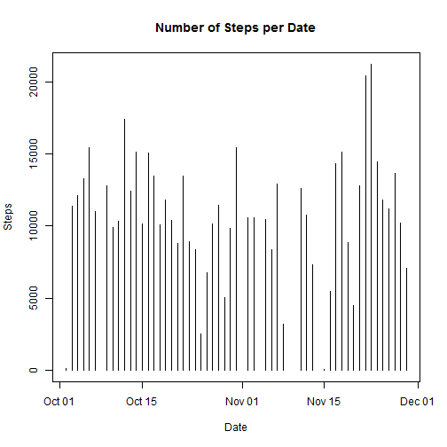
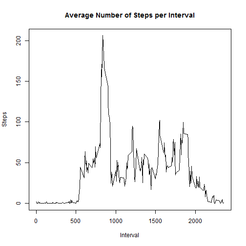
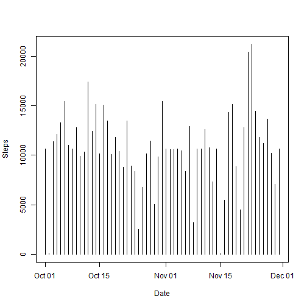
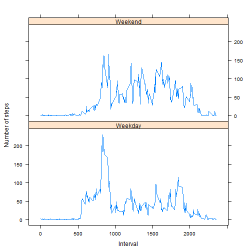

#Reproducible Research: Peer Assessment 1 
######Konstantinos Koumoundouros
___

The steps for the completion of Peer Assessment 1 for the Reproducible Research Course.


###Loading and preprocessing the data
___

First set the local settings to English (because i have different on my working Linux PC).  

In case of **Windows** machine: ```Sys.setlocale("LC_TIME", "English")```  
In case of **Unix** machine: ```Sys.setlocale("LC_TIME", "en_US.UTF-8")```  

For this reason that every OS has different command i check type of OS.

```r
os <- Sys.info()[['sysname']]

if (os == "Windows"){
        Sys.setlocale("LC_TIME", "English") 
} else {
        Sys.setlocale("LC_TIME", "en_US.UTF-8")
}
```

```
## [1] "English_United States.1252"
```

Loading need it library and check if the "activity.csv" is in the working directory or else download it from [Activity monitoring data [52K]](https://d396qusza40orc.cloudfront.net/repdata%2Fdata%2Factivity.zip), unzip it and load it.   


```r
library(lattice)

filename <- "activity.csv"
        
if(!file.exists(filename)){
        temp <- "Factivity.zip"
        url <- "https://d396qusza40orc.cloudfront.net/repdata%2Fdata%2Factivity.zip"
        download.file(url = url, destfile = temp, mode = "wb")
        activity <- read.csv(unzip(temp, filename),stringsAsFactors = FALSE)
} else {
        activity <- read.csv(filename, stringsAsFactors = FALSE)
}
```


###What is mean total number of steps taken per day?
___
In order to calculate the total number of steps per day i use a temporary table *"temp"* that consists only the dates that have steps. Then in table *"data"* i calculate the total steps by date. 


```r
temp <- subset(activity, !is.na(activity$steps))
data <- aggregate(temp$steps, by = list(temp$date), FUN = sum)

colnames(data)[1] <- "date"
colnames(data)[2] <- "steps"

plot(as.Date(data$date), data$steps, type = "h", xlab = "Date", ylab = "Steps",
     main = "Number of Steps per Date")
```

 

The **mean** of the total number of steps taken per day equals to:

```r
mean(data$steps)
```

```
## [1] 10766.19
```

The **median ** of the total number of steps taken per day equals to:

```r
median(data$steps)
```

```
## [1] 10765
```


###What is the average daily activity pattern?
___
In order to calculate the average number of steps per day i use the temporary table *"temp"* that consists only the dates that have steps. Then in table *"data"* i calculate the average steps by interval. 

```r
data <- aggregate(temp$steps, by = list(temp$interval), FUN = mean)
colnames(data)[1] <- "interval"
colnames(data)[2] <- "steps"

plot(data$interval, data$steps,  type="l",
     xlab="Interval", ylab="Steps",
     main="Average Number of Steps per Interval")
```

 

The 5-minute interval, on average across all the days in the dataset which contains the maximum number of steps equals to:    

```r
data[which.max(data$steps),1]
```

```
## [1] 835
```


### Imputing missing values
___
Total number of missing values in the dataset equals to (using the table *"activity"* that consist the data without any transformation):

```r
sum(is.na(activity))
```

```
## [1] 2304
```

I create a new dataset replaced the missing values with the average value of steps per interval from previous request.

```r
act.Ch <- activity
act.Ch <- transform(act.Ch, steps = ifelse(is.na(act.Ch$steps), data$steps[match(act.Ch$interval, data$interval)], act.Ch$steps))
act.Ch <- transform(act.Ch, steps = as.integer(act.Ch$steps))
        
data <- aggregate(act.Ch$steps, by = list(act.Ch$date), FUN = sum)
colnames(data)[1] <- "date"
colnames(data)[2] <- "steps"

plot(as.Date(data$date), data$steps, type = "h", xlab = "Date", ylab = "Steps")
```

 

The **mean** of the total number of steps taken per day equals to:

```r
mean(data$steps)
```

```
## [1] 10749.77
```

The **median ** of the total number of steps taken per day equals to:

```r
median(data$steps)
```

```
## [1] 10641
```

As we can see from the plot, filling the missing values not change the trend but only the numbers (are decreased).


##Are there differences in activity patterns between weekdays and weekends?
___
To find any differences between Weekdays and Weekends activities i create a new variable *"TypeOfDay"*.

```r
act.Ch$TypeOfDay <- weekdays(as.Date(act.Ch$date))
Data2Change <- ifelse(act.Ch$TypeOfDay %in% c("Saturday","Sunday"),"Weekend","Weekday")
act.Ch <- cbind(act.Ch, Data2Change)
act.Ch <- act.Ch[,c(1:3, 5)]
names(act.Ch)[4] <- "TypeOfDay"
data <- aggregate(act.Ch$steps, by = list(act.Ch$interval, act.Ch$TypeOfDay ), FUN = mean)
colnames(data)[1] <- "interval"
colnames(data)[2] <- "TypeOfDay"
colnames(data)[3] <- "steps"
xyplot(data$steps ~ data$interval | data$TypeOfDay, type="l", layout=c(1,2),
       xlab="Interval", ylab="Number of steps")
```

 

As we can see from the plot, although that the biggest values is on Weekdays, Weekends has generally higher values.
